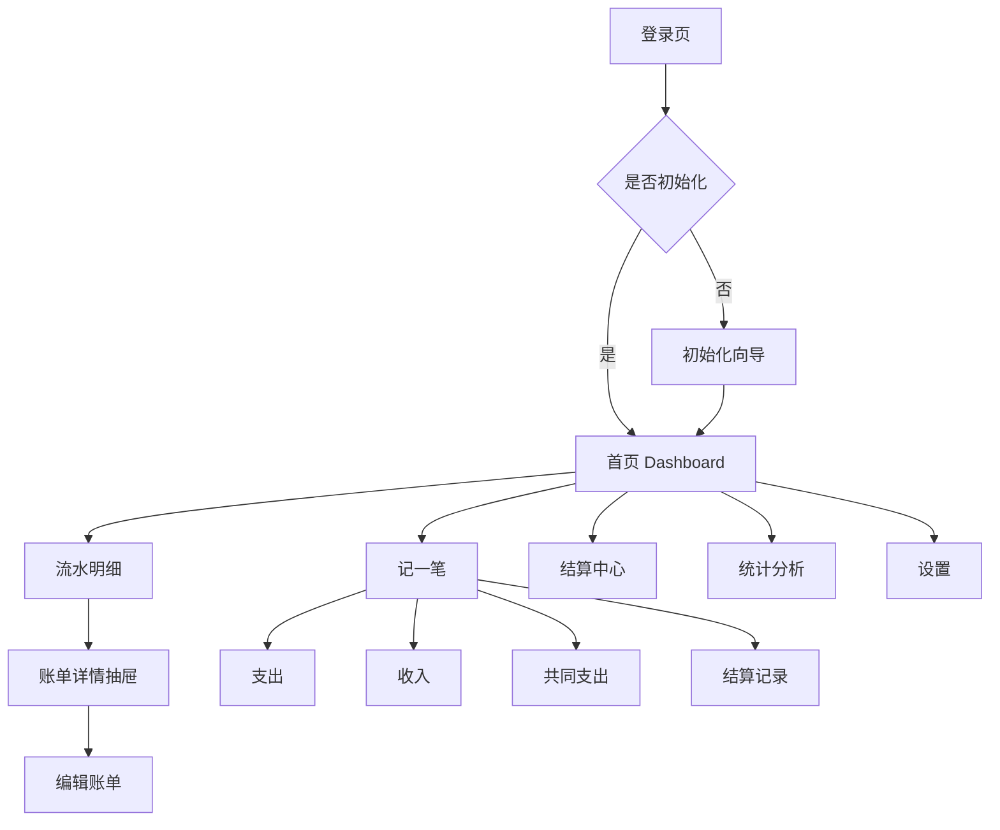

# 01 PRD：双人共享记账工具 LedgerTwo v0.2

## 1. 产品定位

LedgerTwo 是一个面向两个人长期使用的私有化 Web 记账工具，适合情侣、夫妻、合租伙伴或固定搭档记录个人账单、共同支出、分摊关系和结算记录。

产品核心不是完整资产管理，而是回答五个问题：

1. 本月一共花了多少钱？
2. 哪些是共同支出，哪些是个人支出？
3. 谁实际付款多？
4. 谁实际承担多？
5. 现在到底谁应该转给谁多少钱？

## 2. 用户与角色

### 2.1 初版用户

初版固定两个用户：

- 用户 A：例如 polar
- 用户 B：例如 lynn

### 2.2 权限角色

| 角色 | 权限 |
|---|---|
| 管理员 | 用户初始化、分类管理、账户管理、数据导出、备份管理 |
| 成员 | 记账、查看授权账单、查看共同账本、发起结算 |

初版建议两个用户都为管理员，减少家庭内部权限摩擦。

## 3. MVP 范围

### 3.1 必做功能

| 模块 | 功能 |
|---|---|
| 登录 | 本地账号登录、退出、会话保持、修改密码 |
| 初始化 | 首次启动创建两个用户、默认分类、默认账户 |
| 首页 | 本月总支出、我支付、对方支付、待结算、最近流水、分类简报 |
| 记账 | 支出、收入、共同支出、结算、转账预留 |
| 分摊 | 平均分摊、仅付款人承担；预留按比例、按金额 |
| 流水 | 列表、搜索、筛选、排序、详情抽屉 |
| 结算 | 当前谁欠谁、计算明细、生成结算记录、历史结算 |
| 统计 | 趋势、分类、成员、标签 |
| 设置 | 用户、分类、标签、账户、数据导出、备份 |
| 部署 | Docker Compose、SQLite、群晖 NAS、Tailscale 访问 |

### 3.2 初版暂不做

- 银行卡自动同步
- 微信/支付宝账单自动导入
- OCR 小票识别
- 预算系统
- 多账本
- 多成员复杂权限
- 投资资产管理
- 多币种汇率换算

### 3.3 第二阶段扩展

- PWA 安装到手机桌面
- 微信/支付宝 CSV 导入
- 小票附件
- 周期账单
- 预算提醒
- 多成员扩展
- 多账本，例如家庭账本、旅行账本、育儿账本
- 审计日志 UI

## 4. 页面结构

## 5. 核心业务对象

| 对象 | 说明 |
|---|---|
| 用户 User | 两个固定使用者 |
| 账本 Ledger | 初版只有一个共享账本 |
| 账户 Account | 现金、微信、支付宝、银行卡、信用卡 |
| 分类 Category | 餐饮、购物、交通、娱乐等 |
| 标签 Tag | 午餐、外卖、超市、电影等横向标签 |
| 账单 Transaction | 支出、收入、共同支出、结算等 |
| 分摊 Split | 一笔共同支出中每个人承担多少 |
| 结算 Settlement | 一方实际转账给另一方的记录 |

## 6. 核心业务规则

### 6.1 付款人不等于承担人

示例：polar 付款 ¥100，polar 和 lynn 平均分摊。

| 成员 | 实际付款 | 应承担 | 净额 |
|---|---:|---:|---:|
| polar | ¥100 | ¥50 | +¥50 |
| lynn | ¥0 | ¥50 | -¥50 |

结果：lynn 应向 polar 支付 ¥50。

### 6.2 可见性

| 可见性 | 含义 |
|---|---|
| private | 仅自己可见 |
| partner_readable | 对方可查看但不可编辑 |
| shared | 共同账本，双方可见，参与结算 |

### 6.3 结算规则

每个人净额 = 实际支付金额 - 实际应承担金额。

- 净额 > 0：说明这个人垫付了钱
- 净额 < 0：说明这个人需要补钱
- 两个人净额绝对值相等，方向相反

结算时不直接修改历史账单，而是新增一条 `settlement` 类型记录，保证历史可追踪。

## 7. 首页需求

首页回答四个问题：

1. 本月总支出多少？
2. 我支付多少，对方支付多少？
3. 当前谁欠谁多少钱？
4. 最近有哪些账单？

首页模块：

- 顶部账本状态
- 月份切换
- 核心数据卡片
- 当前结算关系
- 最近流水
- 分类简报

## 8. 流水明细需求

流水页是高频页面，桌面端使用表格 + 右侧详情抽屉，移动端使用卡片列表。

筛选条件：

- 月份
- 成员
- 分类
- 标签
- 金额区间
- 账单类型
- 分摊方式
- 可见性

操作：

- 新增
- 编辑
- 删除
- 复制一笔
- 查看详情

## 9. 记一笔需求

点击 `+ 记一笔` 后打开抽屉或移动端底部弹窗。

字段：

- 类型：支出 / 收入 / 转账 / 结算
- 金额
- 分类
- 付款人
- 参与消费人
- 分摊方式
- 标签
- 日期
- 备注
- 可见性

分摊方式：

| 方式 | MVP | 说明 |
|---|---|---|
| 平均分摊 | 是 | 双人共同消费默认方式 |
| 仅付款人承担 | 是 | 个人消费但可在共享账本中展示 |
| 按比例 | 预留 | 房租、水电、旅行等 |
| 按金额 | 预留 | 一笔账中两人消费不同 |

## 10. 结算中心需求

结算中心是双人账本的核心页面。

展示：

- 当前谁应该给谁多少钱
- 本月/全部未结算金额
- 双方实际支付金额
- 双方实际承担金额
- 双方净额
- 已结算记录

操作：

- 标记为已结算
- 生成结算记录
- 查看计算明细
- 查看历史结算

## 11. 统计分析需求

统计页拆成四个 Tab：

| Tab | 内容 |
|---|---|
| 趋势 | 每月总支出变化 |
| 分类 | 分类金额、占比、明细跳转 |
| 成员 | 实际付款、实际承担、净垫付、个人消费、共同消费 |
| 标签 | 标签消费金额排行、标签出现频率 |

## 12. 设置需求

设置页包含：

- 成员设置
- 分类设置
- 标签设置
- 账户设置
- 数据导出
- 备份状态
- 系统信息

## 13. 验收标准

### 13.1 基础验收

1. 两个用户可登录。
2. 可以创建支出、收入、共同支出、结算记录。
3. private 账单对方不可见。
4. partner_readable 账单对方可读不可改。
5. shared 账单双方可见并参与结算。
6. 首页显示本月总支出、我支付、对方支付、待结算。
7. 流水页可筛选、搜索、查看详情。
8. 结算页可生成结算记录。
9. 统计页可查看分类、成员、标签、趋势。

### 13.2 分摊验收

1. polar 支付 200，两人平摊，lynn 欠 polar 100。
2. lynn 支付 80，两人平摊，polar 欠 lynn 40。
3. 净额为 lynn 欠 polar 60。
4. lynn 结算 60 后，系统显示双方已结清。
5. 删除或修改共同账单后，结算关系自动更新。

### 13.3 部署验收

1. 群晖 NAS 通过 Docker Compose 启动。
2. 浏览器可访问。
3. 重启容器数据不丢失。
4. 能生成备份。
5. 能导出 CSV/JSON。
6. 可通过 Tailscale 异地访问。
