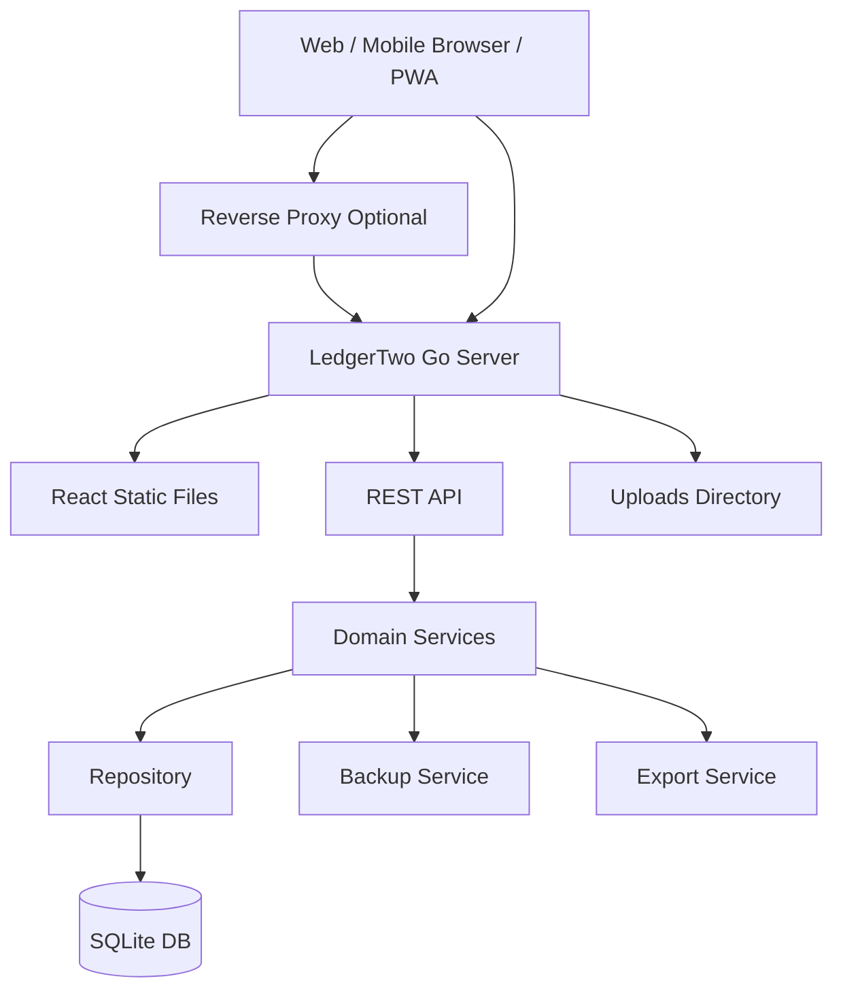

# 03 技术设计文档：LedgerTwo v0.2

## 1. 设计目标

系统需要满足：

1. 2 人长期稳定使用。
2. Web 端优先，移动浏览器体验良好。
3. 私有化部署在群晖 NAS。
4. 数据可靠，可备份、可导出、可迁移。
5. 预留 PWA、移动端 App、小程序或桌面端的接口扩展能力。

## 2. 架构选型方案对比

### 2.1 后端方案

| 方案 | 优点 | 缺点 | 适用性 |
|---|---|---|---|
| Go + SQLite | 单体服务简单、性能好、资源占用低、适合 NAS、便于 Docker 部署 | SQLite 需要注意并发写入；CGO 构建要处理 | 推荐 MVP |
| Node.js + NestJS + SQLite/Postgres | 前后端 TypeScript 统一、生态丰富、开发快 | 运行时依赖较多；NAS 资源占用略高 | 可选 |
| Python FastAPI + SQLite | 开发快、接口清晰、生态成熟 | 长期部署依赖管理略复杂；性能不是问题但不如 Go 清爽 | 可选 |
| Java Spring Boot + PostgreSQL | 工程化强、生态完整 | 对两人小工具太重，NAS 资源占用高 | 不推荐 MVP |

推荐：`Go + SQLite`。

### 2.2 前端方案

| 方案 | 优点 | 缺点 | 适用性 |
|---|---|---|---|
| React + Vite + TypeScript | 生态成熟、构建快、适合 Web/PWA、组件复用强 | 需要自己组织工程结构 | 推荐 MVP |
| Vue 3 + Vite | 上手快、模板直观、适合中小应用 | 跨端 React Native 复用弱 | 可选 |
| Next.js | 路由和 SSR 完整 | NAS 单体部署下复杂度更高，SSR 对本项目收益不大 | 不推荐 MVP |
| Flutter Web | 跨端强 | Web 表单和 SEO 体验一般，包体较大 | 不推荐 MVP |

推荐：`React + TypeScript + Vite`。

### 2.3 数据库方案

| 方案 | 优点 | 缺点 | 适用性 |
|---|---|---|---|
| SQLite | 单文件、备份简单、无需维护数据库服务 | 高并发写入不适合；多人扩展有限 | 推荐 MVP |
| PostgreSQL | 强一致、复杂查询强、扩展性好 | 部署维护更重 | v0.3 可迁移 |
| MySQL/MariaDB | 常见、群晖支持较多 | 对本项目无明显优势 | 可选但不推荐 |

推荐：MVP 使用 SQLite，抽象 Repository 层，预留 PostgreSQL 迁移。

### 2.4 API 风格

| 方案 | 优点 | 缺点 | 适用性 |
|---|---|---|---|
| REST JSON | 简单、浏览器/移动端/小程序都好接入 | 复杂聚合接口需要 DTO 设计 | 推荐 |
| GraphQL | 前端灵活 | 服务端复杂度高 | 不推荐 MVP |
| gRPC | 类型强、性能好 | 浏览器直接接入麻烦 | 不推荐 MVP |

推荐：REST JSON，并生成 OpenAPI 文档，预留跨端客户端生成。

## 3. 总体架构



## 4. 部署架构

```text
群晖 NAS
└── Docker Container: ledger-two
    ├── Go API Server
    ├── React Static Files
    ├── /app/data/ledger.db
    ├── /app/backups/
    └── /app/uploads/
```

访问路径：

1. 局域网：`http://NAS-IP:8088`
2. Tailscale：通过 NAS 内网 IP 或 Tailscale 地址访问
3. 可选反向代理：`https://ledger.example.com`

## 5. 后端模块设计

```text
internal/
  app/              应用启动、路由注册、依赖装配
  config/           配置读取
  db/               SQLite 连接、事务、迁移
  auth/             登录、密码、Session、权限
  user/             用户管理
  account/          账户管理
  category/         分类管理
  tag/              标签管理
  transaction/      账单核心
  split/            分摊逻辑
  settlement/       结算逻辑
  report/           统计报表
  dashboard/        首页聚合 DTO
  export/           CSV/JSON 导出
  backup/           数据备份
  audit/            审计日志
  middleware/       中间件
  response/         统一响应
```

## 6. 领域边界

### 6.1 Transaction Service

负责：

- 普通支出
- 收入
- 转账预留
- 删除/编辑
- 权限校验
- 审计日志触发

### 6.2 Split Service

负责：

- 平均分摊
- 仅付款人承担
- 按比例分摊预留
- 按金额分摊预留
- 校验分摊总额等于账单金额

### 6.3 Settlement Service

负责：

- 计算实际支付
- 计算实际承担
- 计算净额
- 创建结算记录
- 查询结算历史

### 6.4 Report Service

负责：

- 月度趋势
- 分类统计
- 标签统计
- 成员统计
- 共同支出统计

## 7. 跨端接口预留

为了后续支持 PWA、React Native、Flutter、小程序或桌面端，API 层必须保持平台无关。

设计要求：

1. 所有接口使用 JSON。
2. 金额统一使用整数分。
3. 时间统一使用 ISO 8601。
4. 错误码稳定，不返回后端异常文本。
5. 接口版本前缀：`/api/v1`。
6. 登录接口支持 Cookie Session，预留 Bearer Token。
7. 上传接口与业务数据解耦。
8. 提供 OpenAPI 文档。

## 8. 安全设计

### 8.1 登录安全

- 密码使用 Argon2id 或 bcrypt。
- Cookie 使用 HttpOnly。
- SameSite 使用 Lax 或 Strict。
- HTTPS 下开启 Secure。
- 登录失败限流。
- 默认关闭公开注册。

### 8.2 数据安全

- 金额数据禁止硬删除，使用软删除。
- 修改金额、删除账单、结算操作写审计日志。
- 备份使用 SQLite backup API 或 `VACUUM INTO`。
- 导出功能仅管理员可用。

### 8.3 网络安全

推荐优先使用 Tailscale 私有访问，不开放公网端口。

## 9. 数据可靠性设计

1. SQLite 使用 WAL 模式。
2. 每日自动备份。
3. 支持手动备份。
4. 支持 CSV/JSON 导出。
5. 备份目录挂载到 NAS volume。
6. 建议同步到 NAS 外第二位置。

## 10. 性能设计

目标：

- 首页接口 < 300ms
- 流水分页每页 20 或 50 条
- 统计按月聚合
- 数据量 10 万条内流畅

优化方式：

- `occurred_at` 加索引
- `type`、`payer_user_id`、`category_id` 加组合索引
- Dashboard 使用聚合 SQL，不让前端全量计算
- 报表接口可增加短期缓存

## 11. 可观测性

MVP 需要基础日志：

- 请求日志
- 错误日志
- 登录失败日志
- 备份日志
- 导出日志

后续可加入：

- `/healthz`
- `/metrics`
- Prometheus 指标
- 结构化 JSON 日志
