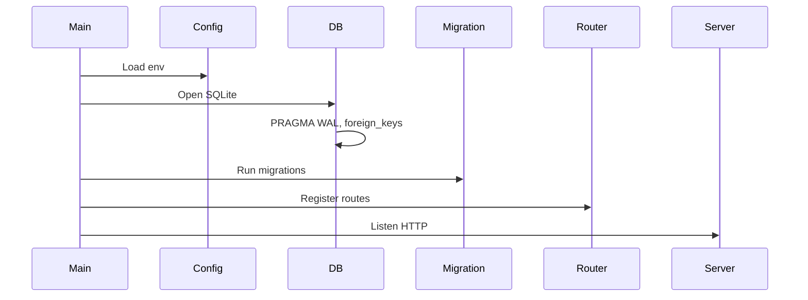
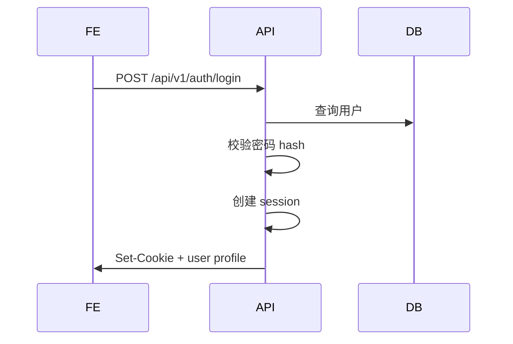

# 04 技术实现文档：LedgerTwo v0.2

## 1. 工程结构

```text
ledger-two/
  backend/
    cmd/server/main.go
    internal/
    migrations/
  frontend/
    src/
  deploy/
    docker/Dockerfile
  docs/
  docker-compose.yml
  .env.example
```

## 2. 后端实现方案

### 2.1 Go Web 框架选择

| 框架 | 优点 | 缺点 | 推荐 |
|---|---|---|---|
| chi | 轻量、标准库友好、中间件清晰 | 需要自己组织更多结构 | 推荐 |
| gin | 生态大、上手快 | 框架风格更强 | 可选 |
| fiber | 性能高、API 类 Express | 非标准 net/http 生态 | 不推荐 MVP |

推荐使用 chi，原因是项目小而长期维护，标准库兼容性和清晰路由更重要。

### 2.2 数据访问选择

| 方案 | 优点 | 缺点 | 推荐 |
|---|---|---|---|
| sqlc | SQL 可控、类型安全、性能好 | 写 SQL 多一些 | 推荐长期方案 |
| GORM | 开发快、CRUD 简单 | 复杂 SQL 不够直观 | MVP 可用 |
| sqlx | 灵活、轻量 | 类型安全弱于 sqlc | 可选 |

推荐：如果你想工程质量更高，选 sqlc；如果想快速出 MVP，选 GORM。

### 2.3 后端启动流程



### 2.4 SQLite 初始化

启动时执行：

```sql
PRAGMA foreign_keys = ON;
PRAGMA journal_mode = WAL;
PRAGMA busy_timeout = 5000;
```

### 2.5 金额处理

金额一律使用整数分。

后端 DTO：

```go
type Money int64
```

禁止使用 float64 存储金额。

### 2.6 统一响应

```go
type APIResponse[T any] struct {
    Success bool       `json:"success"`
    Data    *T         `json:"data,omitempty"`
    Error   *APIError  `json:"error,omitempty"`
}

type APIError struct {
    Code    string `json:"code"`
    Message string `json:"message"`
}
```

### 2.7 错误码

| 错误码 | 说明 |
|---|---|
| UNAUTHORIZED | 未登录 |
| FORBIDDEN | 无权限 |
| VALIDATION_ERROR | 参数错误 |
| NOT_FOUND | 资源不存在 |
| CONFLICT | 数据冲突 |
| INTERNAL_ERROR | 服务异常 |

## 3. 认证实现

### 3.1 登录流程



### 3.2 Session 存储

MVP 可使用服务端签名 Cookie，用户少，足够简单。

更稳妥方案：数据库 session 表。

推荐 MVP：数据库 session 表，便于主动退出和设备管理。

```sql
CREATE TABLE sessions (
    id TEXT PRIMARY KEY,
    user_id TEXT NOT NULL,
    token_hash TEXT NOT NULL,
    expires_at TEXT NOT NULL,
    created_at TEXT NOT NULL,
    FOREIGN KEY (user_id) REFERENCES users(id)
);
```

## 4. 账单实现

### 4.1 创建普通支出

流程：

1. 校验登录。
2. 校验金额 > 0。
3. 校验分类存在。
4. 校验付款人合法。
5. 写入 `transactions`。
6. 写入 tags 关联。
7. 写入 audit_logs。
8. 返回账单详情。

### 4.2 创建共同支出

流程：

1. 校验金额。
2. 校验支付人。
3. 校验参与人必须包含至少 1 人。
4. 根据分摊方式生成 splits。
5. 校验 split 总额等于账单金额。
6. 开启数据库事务。
7. 写入 transaction，type 为 `shared_expense`，visibility 为 `shared`。
8. 写入 transaction_splits。
9. 写入 tags。
10. 写入 audit_logs。
11. 提交事务。

伪代码：

```go
func CreateSharedExpense(ctx context.Context, req CreateSharedExpenseRequest) (*TransactionDTO, error) {
    if req.Amount <= 0 { return nil, ErrInvalidAmount }
    splits, err := splitSvc.BuildSplits(req.Amount, req.SplitMethod, req.Participants)
    if err != nil { return nil, err }
    if sum(splits) != req.Amount { return nil, ErrSplitAmountMismatch }

    return repo.WithTx(ctx, func(tx Tx) (*TransactionDTO, error) {
        t := Transaction{Type: "shared_expense", Visibility: "shared"}
        saved := tx.InsertTransaction(t)
        tx.InsertSplits(saved.ID, splits)
        tx.InsertAuditLog(...)
        return saved, nil
    })
}
```

### 4.3 分摊算法

#### 平均分摊

金额不能整除时，余数分配给付款人或第一个参与人，保证总额一致。

示例：100 分两人平均：50、50。

示例：101 分两人平均：51、50。

#### 仅付款人承担

所有 share_amount 都归付款人，其他参与人不生成 split 或生成 0 split。

建议生成 0 split，方便 UI 展示参与关系。

#### 按比例预留

比例使用万分比：50% = 5000。

#### 按金额预留

用户直接输入每个人承担金额，后端校验总额。

## 5. 结算实现

### 5.1 计算公式

成员净额 = 实际支付金额 - 实际承担金额 - 已支付结算金额 + 已收到结算金额。

双人场景下：

- A 净额 > 0，B 净额 < 0，则 B 应向 A 支付。
- A 净额 < 0，B 净额 > 0，则 A 应向 B 支付。

### 5.2 SQL 思路

1. 查询 shared_expense 中 payer_user_id 的实际付款。
2. 查询 transaction_splits 中每个 user_id 的应承担。
3. 查询 settlements 中 from/to 金额。
4. 聚合生成两个人的 balance。

### 5.3 生成结算记录

`POST /api/v1/settlements`

创建一条 settlement 记录，并可同步创建一条 transaction 类型为 `settlement` 的账单，用于流水展示。

推荐保留 settlements 独立表，同时在 transactions 中展示一条结算流水。

## 6. 报表实现

### 6.1 Dashboard DTO

```go
type DashboardDTO struct {
    Month              string                 `json:"month"`
    TotalExpense       int64                  `json:"total_expense"`
    MyPaid             int64                  `json:"my_paid"`
    PartnerPaid        int64                  `json:"partner_paid"`
    SharedBalance      SharedBalanceDTO       `json:"shared_balance"`
    RecentTransactions []TransactionListItem  `json:"recent_transactions"`
    CategorySummary    []CategorySummaryItem  `json:"category_summary"`
}
```

### 6.2 分类统计

按 `category_id` 聚合 expense 和 shared_expense。

结算记录不计入消费统计。

### 6.3 成员统计

成员统计必须区分：

- 实际付款
- 实际承担
- 净垫付
- 个人消费
- 共同消费

## 7. 前端实现

详见 `05_FRONTEND_DESIGN.md`。

## 8. 测试实现

### 8.1 单元测试

重点测试：

- 金额转换
- 平均分摊
- 按比例分摊
- 结算净额
- 权限判断

### 8.2 集成测试

使用临时 SQLite 数据库。

测试场景：

1. 创建两个用户。
2. A 支付共同支出。
3. B 支付共同支出。
4. 计算净额。
5. 生成结算记录。
6. 再次计算净额。

### 8.3 E2E 测试预留

后续可以使用 Playwright：

- 登录
- 记一笔
- 筛选流水
- 生成结算

## 9. 构建实现

### 9.1 前端构建

```bash
cd frontend
npm ci
npm run build
```

### 9.2 后端构建

```bash
cd backend
go build -o ledger-two ./cmd/server
```

### 9.3 Docker 多阶段构建

详见 NAS 部署文档。
