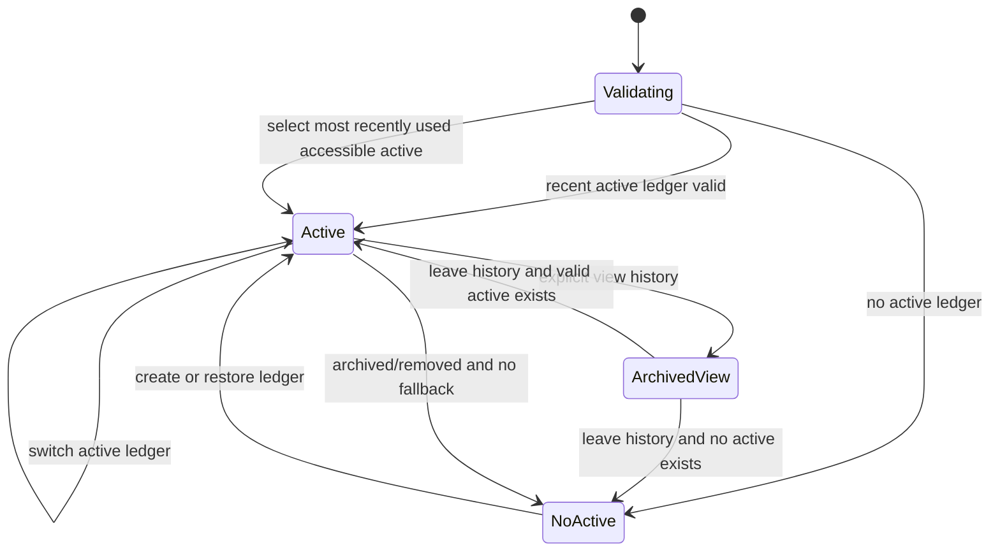

# v1.3 Task50 多账本 Fresh Light 交互流程

状态：Task50P.5 冻结  
冻结日期：2026-07-15  
适用版本：v1.3 Task50.4-Task50.5  
关联事实源：`../prd/31-prd-v1.3-multi-ledger.md`、`../api/openapi-v1.3-ledger-draft.yaml`、`../prd/32-v1.3-task50-acceptance-fixtures.md`

## 1. 设计目标与边界

Task50 的 UI 目标是让用户始终知道“正在查看哪个账本、自己的角色、当前是否只读，以及下一步能做什么”。多账本不是在顶部增加一个下拉框，而是完整覆盖创建、切换、归档、恢复、成员变化、失效回退和无活跃账本。

本流程冻结：

1. active 日常切换与 archived 历史查看严格区分。
2. Owner/Editor/Viewer、实例管理员和无权限状态不混用。
3. 危险操作展示后果、金额与恢复路径，不使用模糊“确定”。
4. 复用 UI-FL-01 至 UI-FL-10 的 Token、AppShell、Button、Dialog、Sheet、StatePanel 和断点。
5. 不新增第三名成员、邀请链接、共同支付通知、多人分摊、删除账本或单账本物理备份。
6. 本文是开发前 UI 契约，不代表路由、API 或 Frame 已实现/线上同步。

## 2. 信息架构与路由

### 2.1 路由冻结

| 路由 | 用途 | 可访问角色 | 备注 |
|---|---|---|---|
| `/settings/ledgers` | 账本管理列表 | 所有已登录用户 | canonical 管理入口 |
| `/settings/ledgers/:ledgerId` | 账本资料与成员 | 该账本成员 | active/archived 均可查看 |
| `/?archived_ledger_id=:id` | 归档历史 Dashboard | 该账本成员 | 显式临时查看，不写最近 active 偏好 |
| `/transactions?archived_ledger_id=:id` | 归档历史流水 | 该账本成员 | 全局只读 Guard，隐藏写动作 |
| `/analytics?archived_ledger_id=:id` | 归档历史分析 | 该账本成员 | settlement 仍不进入消费统计 |
| `/settlement?archived_ledger_id=:id` | 归档历史结算 | 该账本成员 | 只读余额和记录，不允许登记 |

不为归档账本复制一套页面。`archived_ledger_id` 只建立临时只读 viewing context，离开历史查看后恢复最近有效 active 账本或 no-active shell。

### 2.2 设置导航

`/settings` 的“账本与成员”分区保留摘要，但主动作改为“管理账本”，进入 `/settings/ledgers`。现有元数据、导入、备份和诊断入口不迁入账本详情：

1. 账本导出可在账本详情的数据区域访问。
2. 整库备份/恢复/诊断仅对 `instance_admin=true` 展示，不能因当前角色是 Owner 自动展示。
3. 元数据继续使用既有设置子路由，受当前 active/archived context Guard 控制。

## 3. 前端状态模型

### 3.1 三类上下文

| 状态 | 来源 | 是否持久化 | 是否挂载业务查询 | 写入口 |
|---|---|:---:|:---:|:---:|
| active context | 已校验 active 列表 + 最近偏好 | 是，仅 ledger ID/最近时间 | 是 | 按角色开放 |
| archived viewing context | 用户从管理页显式点击“查看历史” | 否 | 是，只读 | 全部隐藏/禁用 |
| no-active-ledger | 无可访问 active 账本 | 否 | 否 | 只允许创建/查看归档 |

Zustand 中 role/status 只能是当前响应快照，不是长期权限事实。刷新后必须重新请求 `/ledgers`；无效偏好不能 fallback 到数据库首账本。

### 3.2 状态转换



切换账本时先取消旧账本 query，再更新 context；迟到响应必须因 ledger ID 不匹配被丢弃。

## 4. AppShell 账本选择器

### 4.1 Desktop

侧栏账本区域固定包含：

1. 当前账本名称，最长 60 字符，两行截断；hover/focus 显示完整名称。
2. 角色标签：Owner、Editor、Viewer；状态标签不只靠颜色。
3. active 账本列表，按最近使用排序；不混入 archived。
4. “管理账本”命令和已归档数量，例如“已归档 2”。
5. 加载、列表失败、仅一个账本和无 active 账本状态。

切换完成后关闭 popover，主内容显示一次“已切换到 {name}”。失败保持原账本，不先乐观显示目标数据。

### 4.2 Mobile

移动顶部点击账本名称打开 Bottom Sheet：

1. Sheet 高度由内容决定，最大 78dvh。
2. active 账本行使用 48px 最小高度，当前项有图标和“当前”文字。
3. 底部固定“管理账本”，不使用文本型圆角装饰。
4. archived 不在日常 Sheet 中列出，只显示“已归档 N”入口。
5. 打开/关闭后焦点返回顶部账本按钮。

### 4.3 归档查看态

归档历史进入后：

1. AppShell 顶部显示“已归档 · 只读”和账本名。
2. 隐藏桌面“记一笔”、移动 FAB、结算登记、导入、元数据和周期写入口。
3. 页面顶部使用非浮动全宽状态带：“正在查看已归档账本，历史数据不会被修改”。
4. Owner 可见“恢复账本”，其他角色可见“返回活跃账本”。
5. 归档查看不写 `activeLedgerId` 或最近 active 时间。

## 5. 账本管理页

### 5.1 页面结构

`/settings/ledgers` 使用全宽设置内容区，不把整个 section 包在卡片中：

1. 顶部紧凑标题“账本管理”和创建图标按钮/“创建账本”命令。
2. Segmented Control：活跃、已归档；标签包含数量。
3. Desktop 使用表格/行列表，Mobile 使用同字段卡片；不得嵌套卡片。
4. 每项固定显示名称、状态、本人角色、成员数、更新时间和唯一主要动作。
5. 次级操作进入 `MoreVertical` 菜单；高风险操作不直接放在行尾裸图标。

### 5.2 角色动作

| 状态/角色 | 查看详情 | 切换/查看历史 | 重命名 | 归档 | 恢复 | 离开 |
|---|:---:|:---:|:---:|:---:|:---:|:---:|
| active Owner | 是 | 切换 | 是 | 是 | 不适用 | 先移交 |
| active Editor | 是 | 切换 | 否 | 否 | 不适用 | 是 |
| active Viewer | 是 | 切换 | 否 | 否 | 不适用 | 是 |
| archived Owner | 是 | 查看历史 | 否 | 不适用 | 是 | 否 |
| archived Editor/Viewer | 是 | 查看历史 | 否 | 不适用 | 否 | 否 |

禁用动作必须在 tooltip 或行内说明原因；服务端 403/409 仍是最终权威。

### 5.3 创建与重命名

1. Desktop 使用 Dialog，Mobile 使用 Bottom Sheet，字段和校验一致。
2. 名称 trim 后 1-60 个 Unicode 字符；允许同名，不能用“重名”作为错误。
3. 创建提交期间锁定主按钮，失败保留输入；成功后成为 active context 并进入新账本 Dashboard。
4. 重命名携带当前 ETag；版本冲突保留输入并提供“刷新账本信息”，不能自动覆盖。
5. archived 不显示重命名入口。

### 5.4 空、加载与错误

| 状态 | 文案目标 | 动作 |
|---|---|---|
| active empty | 暂无活跃账本 | 创建账本、查看已归档 |
| archived empty | 暂无已归档账本 | 返回活跃账本 |
| loading | 保持列表稳定尺寸 | Skeleton，不显示空态 |
| list error | 无法读取账本列表 | 重试；保留已显示旧列表但标注未更新 |
| permission lost | 已失去该账本访问权限 | 返回可用账本/无账本 shell |
| version conflict | 账本已被另一处更新 | 刷新后重新确认 |

## 6. 归档与恢复

### 6.1 归档确认

归档 Dialog/Sheet 必须先调用 `GET /ledgers/{ledgerId}/archive-preflight`，并展示服务端预检快照：

```text
账本：共同生活
状态变化：活跃 -> 已归档（全员只读）
未结清：Alice 需向 Bob 支付 ¥128.50
待处理导入：1 个 ready 批次
```

规则：

1. 未结清净额不阻止归档；金额为 0 时显示“当前已结清”。
2. 未结清时需勾选“我知道归档不会自动生成结算记录”。
3. ready 批次大于 0 时主动作不可用，提供“前往导入处理”。
4. 导入页允许完成或显式放弃批次；放弃说明“预览会过期，正式流水不会新增”。
5. 主动作写“归档账本”，不能写“确定”；成功后执行确定性 active 回退并解释原因。

### 6.2 恢复确认

恢复仅 Owner：

1. 明确恢复后重新开放 Owner/Editor 写入。
2. 不承诺自动补生成归档期周期账单。
3. 成功后刷新列表；用户可选择“切换到该账本”，但不强制打断当前 active 工作。
4. version conflict 要求刷新后重试。

## 7. 账本详情与成员管理

### 7.1 页面结构

`/settings/ledgers/:ledgerId` 包含三个无卡片嵌套的 section：

1. 基本信息：名称、状态、本人角色、创建/归档时间。
2. 成员：最多两行，显示用户名、角色、加入时间与动作。
3. 数据操作：账本 CSV/JSON 导出；实例运维不在此 section。

归档态所有成员写动作禁用；Owner 只保留恢复。Editor/Viewer 不看到 Owner 专属危险菜单，但可看到自己的“离开账本”（仅 active）。

### 7.2 添加成员

添加第二成员前展示固定警告：

1. 新成员可读取该账本既有 `partner_readable` 与 `shared` 历史。
2. `private` 账单仍不可见。
3. 添加不会把历史账单所有者改成新成员，也不会生成/修改分摊。
4. 需要显式勾选“我已确认历史可见性范围”。
5. 角色仅可选 Editor/Viewer；满两人时不显示表单，显示“两人上限已满”。

### 7.3 角色变更

1. Owner 通过 Select/菜单将非 Owner 在 Editor/Viewer 间切换。
2. 每个角色旁显示能力摘要，不以颜色表达：Editor“可记账、结算、导出”，Viewer“只读，不可导出”。
3. 角色变更使用当前 ETag；失败后回滚 UI 值并显示服务端原因。
4. Owner 角色不在普通 Select 中出现。

### 7.4 Owner 移交

独立危险确认必须显示：

1. 目标用户将成为唯一 Owner。
2. 当前用户将变为 Editor，失去账本归档与成员管理权限。
3. 该操作原子完成，不改变历史账单和结算。
4. 主动作“移交所有权给 {username}”。

成功后立即刷新账本列表、角色和详情；当前页面按照 Editor 权限重新渲染。失败不得出现两位 Owner 的临时 UI。

### 7.5 移除与离开

1. Owner 移除非 Owner：说明对方立刻失去访问，但历史 actor、交易、split、settlement 和附件不删除。
2. Editor/Viewer 离开：说明自己立刻失去访问，返回其他 active 账本或 no-active shell。
3. Owner 点击离开：不打开通用离开确认，改为解释“请先移交所有权”并定位移交动作。
4. archived 账本不允许成员离开或移除，避免归档历史成员关系变化。

## 8. 权限和实例运维

### 8.1 账本角色

| 能力 | Owner | Editor | Viewer |
|---|:---:|:---:|:---:|
| 查看可见数据 | 是 | 是 | 是 |
| 记账/结算 | 是 | 是 | 否 |
| CSV/JSON 账本导出 | 是 | 是 | 否 |
| 导入与规则 | 是 | 否 | 否 |
| 元数据管理 | 是 | 否 | 否 |
| 重命名/归档/恢复 | 是 | 否 | 否 |
| 成员/Owner 管理 | 是 | 否 | 否 |

archived 状态覆盖角色写权限。即使 Owner，也不能在 archived 状态记账、结算、导入或管理成员。

### 8.2 实例管理员

`instance_admin` 与账本角色使用不同视觉分区和文案：

1. `/settings` 的“系统与数据安全”只在 instance admin 时展示备份、备份列表、恢复准备和诊断。
2. 非管理员 Owner 不显示入口；直接访问显示 Permission State，不伪装成账本角色问题。
3. 实例管理员不是账本成员时不能读取任何账本业务数据。
4. 整库运维文案始终写“整个 LedgerTwo 实例”，不能写“当前账本备份”。

## 9. 错误码到 UI 动作

| 错误码 | 用户文案重点 | 主动作 |
|---|---|---|
| `LEDGER_REQUIRED` | 当前未选择有效账本 | 选择/创建账本 |
| `LEDGER_CONTEXT_MISMATCH` | 页面账本状态已变化 | 重新加载 |
| `LEDGER_ACCESS_DENIED` | 已失去访问或角色不足 | 返回账本列表 |
| `LEDGER_ARCHIVED` | 该账本已归档，只能查看历史 | 查看历史/恢复（Owner） |
| `LEDGER_VERSION_CONFLICT` | 另一处已更新账本 | 刷新账本信息 |
| `LEDGER_MEMBER_LIMIT_REACHED` | 当前两人上限已满 | 返回成员列表 |
| `LEDGER_OWNER_TRANSFER_REQUIRED` | Owner 不能直接离开 | 移交所有权 |
| `LEDGER_READY_IMPORT_EXISTS` | 有待确认导入阻止归档 | 前往导入处理 |
| `INSTANCE_ADMIN_REQUIRED` | 需要实例管理员权限 | 返回设置 |

Toast 只用于完成反馈。需要用户选择下一步或存在数据后果时，使用 StatePanel、Dialog 或 Sheet。

## 10. 响应式与可访问性

### 10.1 视口

1. 375px：最窄支持宽度，所有长账本名、用户名、角色与危险文案可换行。
2. 390px：主要移动 Frame。
3. 430px：大屏手机，不能因宽度增加切换成桌面表格。
4. 1440px：桌面表格、侧栏和 Dialog 基线。
5. 1024px 以下沿用 AppShell 移动断点，不为 Task50 新建断点。

### 10.2 可访问性

1. 账本选择器使用 button + listbox/menu 的可访问模式，当前项有 `aria-current` 或等价语义。
2. 状态必须有文字/图标；active/archived、Owner/Editor/Viewer 不只靠颜色。
3. Dialog/Sheet 使用 UI-FL 既有焦点圈定、Escape、遮罩关闭策略和焦点返回。
4. 危险确认主按钮 44px 以上，等待状态禁止重复提交。
5. 版本冲突和表单错误通过可读 live region 通知，不清空输入。
6. 金额使用 `font-variant-numeric: tabular-nums`，不通过字号随 viewport 缩放。

## 11. 组件与代码所有权

| 组件/模块 | 归属 | 复用/新增原则 |
|---|---|---|
| AppShell/移动顶部 | UI-FL-02 | Task50 扩展账本状态，不复制 Shell |
| Button/Dialog/Sheet/StatePanel/StatusChip | UI-FL-01 | 直接复用，不建 `LedgerButton` 等平行原语 |
| Settings section/list geometry | UI-FL-07 | 账本管理复用既有区块，不回写元数据业务 |
| `LedgerSwitcher` | Task50.4 | 唯一 active 切换组件，Desktop/Mobile 共享 model |
| `LedgerManagementPage` | Task50.5 | 新增 `/settings/ledgers` 页面 |
| `LedgerDetailPage` | Task50.5 | 生命周期、成员和账本导出 |
| `ArchivedLedgerBanner` | Task50.5 | 全局只读状态带，复用 StatusChip/Button |
| `NoActiveLedgerShell` | Task50.4 | 只挂载全局请求，不嵌套业务页面 |

UI-FL-10 已完成全局可访问性、主题、响应式和缺陷收口，且未提前创建上述 Task50 组件。Task50 开发必须基于 UI-FL-10 完成提交，不反向修改已关闭 UI-FL 业务页面。

## 12. API 与测试映射

| UI 流程 | API | 验收 ID |
|---|---|---|
| 列表/切换/无账本 | `GET /ledgers` | T50-API-001~003、T50-WEB-001~004 |
| 创建/重命名 | `POST /ledgers`、`PATCH /ledgers/{id}` | T50-LIFE-001~004 |
| 归档/恢复 | lifecycle endpoints | T50-LIFE-005~011 |
| 成员/角色 | members endpoints | T50-MEM-001~005 |
| Owner 移交/离开 | transfer-owner、leave | T50-MEM-006~010 |
| ready 批次处理 | import discard | T50-LIFE-006~008 |
| 账本导出 | `/export/*` + header | T50-OPS-005~007 |
| 实例运维 | `/admin/*` | T50-OPS-001~004、008 |

## 13. Figma/Handoff 范围

本地 handoff 位于 `figma/task50-v1.3-multi-ledger/`。最低 Frame：

1. 账本选择器 desktop/mobile。
2. active/archived 管理列表 desktop/mobile。
3. 创建、重命名、归档、ready 阻断、恢复确认。
4. 成员列表、添加历史警告、角色调整、Owner 移交、移除/离开。
5. archived 只读 Shell、no-active shell、version conflict、permission/error。
6. 375/390/430/1440 关键变体。

Frame Manifest 是“待绘制/待线上同步”的结构化要求，不是线上 Figma 完成证明。线上同步只有记录可访问文件 URL、node ID、账号和验证时间后才能改为 verified。

## 14. Task50P.5 完成判定

P.5 关闭条件：

1. 路由、active/archived/no-active 状态和回退规则无歧义。
2. Owner/Editor/Viewer/实例管理员的入口、禁用和直接 API 拒绝相互一致。
3. 危险确认覆盖归档、ready 阻断、历史可见性、Owner 移交、移除和离开。
4. 375/390/430/1440 Frame 与组件映射可追踪。
5. UI-FL-07、UI-FL-10 与 Task50 文件所有权明确，没有提前实现 Task50 业务。
6. 本地文件明确区分设计要求、生成审阅证据和线上 Figma 同步状态。

P.5 本身不授权编码。UI-FL-10、Task50P.6、Task50.1 与 Task50.2 已关闭；下一实现任务为 Task50.3A，本文件中的页面和组件仍分别等待 Task50.4/50.5，不得提前实现。
